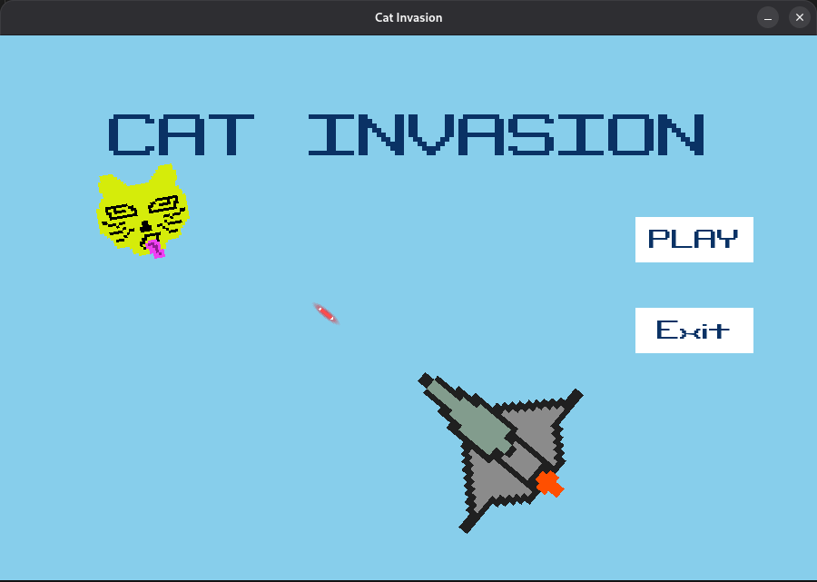
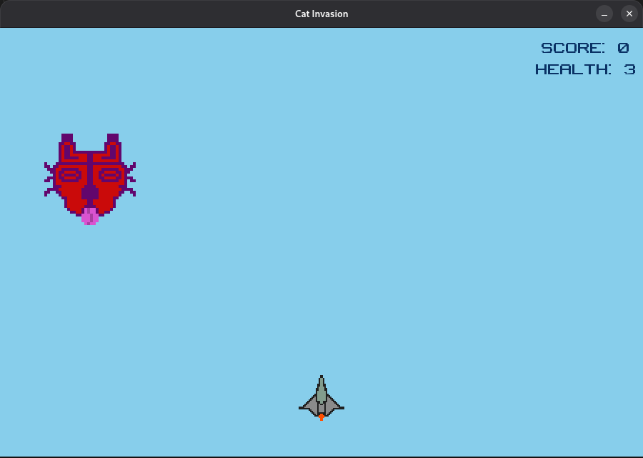

# 🐱 Cat Invasion 🚀

Cat Invasion is a **2D space shooter game** built with **Python + Pygame**.  
The player controls a spaceship and must defeat invading cats by shooting them down while avoiding enemy bullets.  
The game includes a **menu, pause system, respawn mechanics, sounds, music, and score tracking**.

---

## 🎮 Features
- Player spaceship with shooting ability  
- Enemy cats that shoot bullets  
- Random enemy spawn positions and movement  
- Score and deaths counter  
- Player respawn system  
- Game states: **Menu, Play, Pause, Death Screen**  
- Background music and sound effects  
- Retro font (`binaryCHRBRK`)  

---

## 🕹️ Controls
| Key | Action |
|-----|--------|
| **L** | Fire bullet |
| **P** | Pause / Resume game |
| **Mouse** | Click menu buttons (Play, Retry, Exit) |
| **ESC / X** | Quit game |

---

## 📂 Project Structure
```Cat-Invasion/

│── ship.py # Player class
│── enemy.py # Enemy class
│── main.py # Main game loop
│── Assets/ # Images and sounds
│ ├── jet2.png
│ ├── enemy.png
│ ├── player bullet.png
│ ├── shoot.wav
│ └── bgMusic.mp3
└── README.md (this file)
```


---

## ▶️ How to Run
1. Install Python (3.10+ recommended).  
2. Install **Pygame**:
   ```bash
   pip install pygame
Clone or download this repository.

Run the game:

```bash
python main.py
```
📸 Screenshots

Menu



Gameplay



⚡ To-Do / Future Ideas
Add power-ups (extra health, rapid fire, shields)

Boss battles

Multiple enemy types

Levels with increasing difficulty

👨‍💻 Author
Made with ❤️ by Faisal
